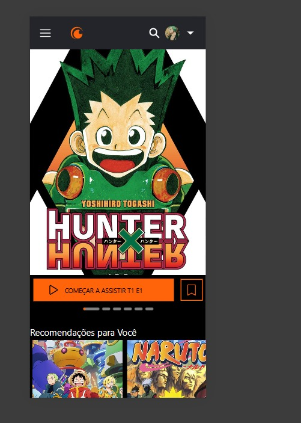
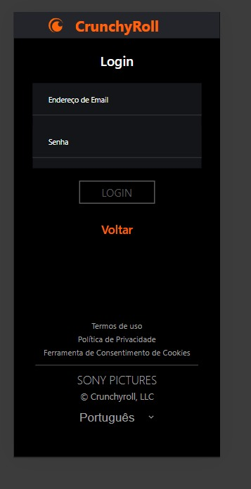

# Projeto de Recriação de Telas Crunchyroll

Este projeto recria as telas do aplicativo Crunchyroll em React Native, comparando as telas originais com as telas recriadas.

## Telas Originais

### Tela Home Original

### Tela Login Original

## Telas Criadas por Mim

### Tela Home Criada

### Tela Login Criada

## Observações
- As imagens acima mostram uma comparação visual entre a interface original e a interface recriada em React Native.
- As telas recriadas mantêm a estrutura e estilo da versão original, com adaptações para React Native.

## Como Rodar o Projeto
1. Clone o repositório.
2. Execute `npm install` para instalar as dependências.
3. Execute `npx react-native run-android` ou `npx react-native run-ios` para visualizar as telas no emulador ou dispositivo conectado.
